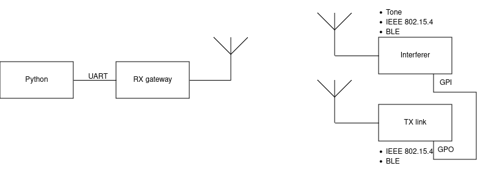
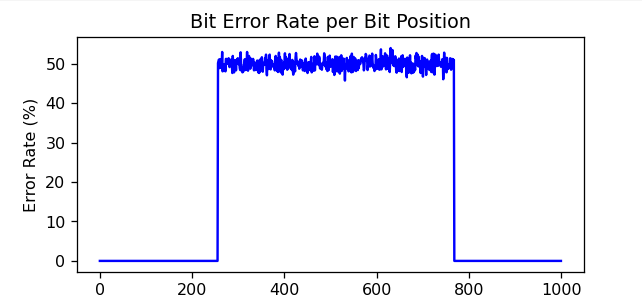

# Coexistence of BLE and IEEE 802.15.4

This directory contains four main Python scripts:

- `serial_logger.py`
- `json_reader.py`
- `add_noise.py`
- `config.py`



## Table of Contents

- [Overview](#overview)
- [File Naming Convention](#file-naming-convention)
- [Usage](#usage)
- [Analysis](#analysis)
- [Requirements](#requirements)

## Overview

The `serial_logger.py` script is responsible for reading packets received via the serial port from an nRF board. Each packet includes an incremental ID (4 Bytes) and an effective payload of up to 120 Bytes. The variables for the experiment, such as the protocol used for the link and the type of interference, are defined in `config.py`.

The received messages are stored in the following format in a JSONL file:

```json
{"id": 2030, "message": [0, 2, 4, ..., 234, 236, 238], "length": 124, "rssi": -28, "crc": 1}
```

## File Naming Convention

The name of the JSONL file is dependent on the experiment variables configured in `config.py` and is stored in the `experiment_data` folder in the following format:

`{radio_mode}_{interferer_mode}_{tx_power_link}dBm{tx_power_interferer}dBm_{freq_diff}MHz.jsonl`

Where:
- `radio_mode` is the protocol used by the receiving board
- `interferer_mode` is the mode used by the interfering board
- `tx_power_link` is the transmission power in dBm of the link's transmitting board
- `tx_power_interferer` is the transmission power in dBm of the interfering board
- `freq_diff` is the frequency difference in MHz between the interferer and the communication link

For example, `BLE1MBit_IEEE802154250Kbit_0dBm0dBm_0MHz.jsonl` is a possible name for the stored data.

## Usage

To begin storing data, use the following command:

```bash
python serial_logger.py -p -s
```

Here, `-p` indicates that the received data will be displayed in the terminal, and `-s` indicates that it will be saved to a JSONL file.

The `json_reader.py` script allows for analysis of the results once the experiments have been completed.

The `add_noise.py` script simulates the addition of noise to the experiments for testing the analysis functions.



## Requirements

To run the scripts, install the required packages listed in `requirements.txt`.

```bash
pip install -r requirements.txt
```
